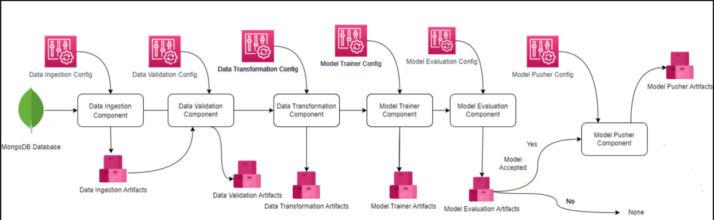

# Detection of Anti-Phishing websites using ensemble-ML models

Anti-phishing refers to efforts to block phishing attacks. Phishing is a kind of cybercrime where attackers pose as known or trusted entities and contact individuals through email, text or telephone and ask them to share sensitive information. 

Dataset source : https://www.kaggle.com/datasets/akashkr/phishing-website-dataset/data

This dataset contains information about several website urls such as **url length**, **shortnening service**, **ssl state** etc. Based on these features, it must be determined whether the website domain is registered or not.

This project was done to understand the life cycle of an end to end machine learning project. The project structure is as follows:


## 1. Project Components:

### Data Ingestion Component
- Collect and store raw data from the MongoDB Database.
- Connects to the MongoDB database to fetch the required data.
- Splits the collected data into training, validation, and testing datasets.
- Outputs Data Ingestion Artifacts, which include the raw dataset and metadata (like schema or data distribution).

### Data Validation Component
- Ensure the quality and consistency of the data.
- Loads data from the Data Ingestion Artifacts.
- Performs validation checks:
- Schema validation (e.g., checking data types and column names).
- Missing value handling.
- Outlier detection.
- Data drift analysis (to check if the data distribution has changed compared to historical data).
- Outputs Data Validation Artifacts, including reports and cleaned data for further processing.

### Data Transformation Component
- Preprocess the data for model training.
- Applies transformations to standardize the data:
- Feature scaling and normalization.
- Encoding categorical variables.
- Feature engineering (creating new features if needed).
- Outputs Data Transformation Artifacts, including transformed data and any preprocessing pipelines 

### Model Trainer Component
- Train the machine learning model using the prepared dataset.
- Loads the transformed data from Data Transformation Artifacts.
- Defines and trains the machine learning model based on the configuration (e.g., hyperparameters, algorithms).
- Validates the model on the validation set and generates metrics (e.g., accuracy, precision, recall).
- Outputs Model Trainer Artifacts, including the trained model and training metrics.

### Model Evaluation Component
- Assess the performance of the trained model to decide whether it should be deployed.
- Loads the trained model from Model Trainer Artifacts.
- Evaluates the model on the testing dataset using predefined evaluation criteria.
- Compares the model's performance with existing models to determine acceptance.
- Outputs Model Evaluation Artifacts, including evaluation reports and acceptance status.


### Model Pusher Component
- Deploy the accepted model into production.
- Checks the acceptance status from Model Evaluation Artifacts.
- If the model is accepted:
- Saves the model as Model Pusher Artifacts.
- Deploys the model to the production environment.
- If the model is not accepted, no deployment is performed.

## 2. Technologies used:
- **Python** for programming
- **Flask** to build the REST API for serving predictions and managing interactions between the frontend and backend.
- **HTML/CSS** for creating a basic frontend interface in the templates directory.
- **MongoDB** used for storing raw and processed data.
- **Scikit-learn** for building and training the phishing detection model.
- **MLflow and Dagshub** for experiment tracking
- **Docker** to containerize the application for consistent deployment across environments.

## 3. Usage
1. Clone the repository to your local machine :
```bash
 git clone https://github.com/swatimishra02/networksecurity.git
 cd networksecurity
 ```
2. Install requirements : 
```bash
pip install -r requirements.txt
```
3. Download phishing dataset from here: [Phishing Data](https://www.kaggle.com/datasets/akashkr/phishing-website-dataset/data), and put it under Network_data folder.
4. Update the config.json file with the correct paths to the dataset and the MongoDB connection string.
5. Run application using `python app.py`


